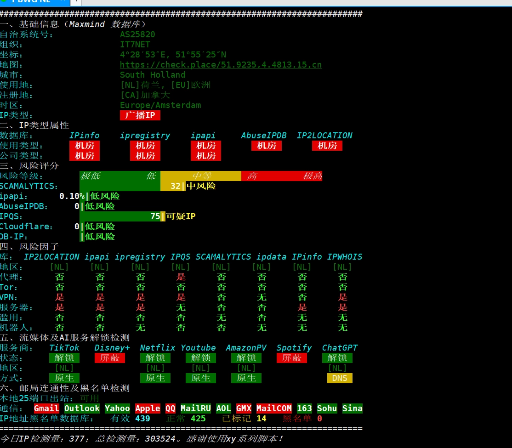

# 搬瓦工荷兰三网GIA套餐上线：Netflix原生解锁+CN2 GIA回程

---

如果你正在找一台能解锁Netflix非自制剧、回国速度又不拉胯的欧洲VPS，这次搬瓦工荷兰机房的三网GIA套餐可能正合你意。年付36美元，三网回程都走CN2 GIA，而且已经确认支持Netflix荷兰区原生解锁。更有意思的是，搬瓦工已经和联通、移动签了合同，后续CMIN2和9929线路也在路上。

---

## 套餐配置

先看基础配置，没什么花里胡哨的：

- **CPU**：AMD 1核
- **内存**：1G
- **硬盘**：20G SSD
- **流量**：1000G/月
- **价格**：年付36美元

这配置说实话很入门，但对于轻度使用或者当个跳板机来说够了。关键是线路和解锁能力。

## 线路情况

目前的回程路由已经实测过了，三网都走CN2 GIA：

- **电信**：全程CN2 GIA精品线路
- **联通**：CN2 GIA + 4837普通线路
- **移动**：CN2 GIA精品线路

从路由追踪看，荷兰阿姆斯特丹到广州的延迟在180-200ms左右，对于欧洲机房来说算正常水平。电信用户体验应该是最好的，移动次之，联通稍微绕一点但也能接受。

如果你经常需要 👉 [稳定的欧洲VPS来跑一些对网络质量要求高的服务](https://bandwagonhost.com/aff.php?aff=79616)，三网GIA回程能省不少麻烦。特别是晚高峰时段，普通163线路可能已经卡成PPT了，GIA线路还能保持基本流畅。

## 流媒体解锁测试

重点来了——Netflix解锁情况：

**Netflix**：完整解锁荷兰区，支持非自制剧
**YouTube**：正常，CDN节点在阿姆斯特丹
**Disney+**：显示即将开通（IP被ban了）
**TikTok**：解锁荷兰区

简单说就是Netflix能看，迪士尼目前不行。如果你主要需求是Netflix，那没问题。YouTube的话，因为CDN在本地，速度应该挺快。

## 性能跑分

Geekbench 5的跑分：
- 单核：793
- 多核：802

这个分数……怎么说呢，能用。AMD EPYC-Genoa处理器，频率2445MHz，对于日常建站、跑个脚本什么的完全够了。如果你要跑什么计算密集型任务，这配置肯定扛不住。

磁盘IO表现还可以：
- 4K读写：15-16 MB/s
- 1M读写：1.3-1.7 GB/s

对于这个价位的VPS来说，磁盘性能算中规中矩。

## IP质量

这个比较有意思，从多个数据库的检测结果看：

- 被识别为数据中心IP（这是肯定的）
- 有部分数据库标记为代理/VPN
- Google搜索显示"NO"（可能有验证码）
- 欺诈分数：32-65分（中等水平）

说白了就是典型的机房IP，不是家宽。如果你需要完全干净的原生IP来注册账号什么的，可能不太适合。但用来看Netflix、日常使用是没问题的。

## 邮件端口

大部分常见邮件服务的端口都是通的，包括QQ邮箱、163、Gmail等。不过Gmail的POP3和IMAP端口被墙了，这个没办法，国内访问国外邮件服务器就这样。

## 值得买吗？

年付36美元，平摊下来一个月3美元。对于需要欧洲节点、又希望回国速度不要太慢的用户来说，这个价格挺合理的。

**适合的场景**：
- 需要解锁Netflix荷兰区内容
- 偶尔需要欧洲IP做一些操作
- 想要一个回国速度还过得去的欧洲跳板
- 预算有限，对性能要求不高

**不适合的场景**：
- 需要大量计算资源
- 对延迟要求极高（比如游戏）
- 需要完全干净的原生家宽IP

另外值得一提的是，联通和移动的CMIN2、9929线路还在对接中。如果后续真的接入了，那回国速度应该还能再提升一档。不过现在的CN2 GIA已经够用了，别抱太高期待。

---

总的来说，这是个定位很明确的套餐：价格便宜、线路靠谱、能解锁Netflix。如果这三点正好是你需要的，那就挺值。如果你需要更高的性能或者更低的延迟，👉 [搬瓦工还有其他更高配置的套餐可以选择](https://bandwagonhost.com/aff.php?aff=79616)，只是价格也会相应提高。
